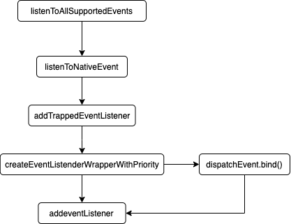

## 前言
事件委托在说事件委托之前，我们首先要了解什么手机[DOM level3](https://www.w3.org/TR/DOM-Level-3-Events/#event-flow) 事件，事件在DOM中传播主要分为三个阶段，事件捕获，事件目标，事件冒泡。通常我们在通过 `addEventListener`为`dom` 添加事件监听时，可以通过指定useCapture的值来调整事件触发时机。默认情况下事件是在冒泡阶段被触发，我们可以通过指定不同的&具有公共祖先的`dom`的相同事件的触发时机来调整事件的触发顺序，具体示例可以看[这里](https://www.quirksmode.org/js/events_order.html#link4)。
```javascript
addEventListener(type, listener);
addEventListener(type, listener, options);
// useCapture 默认值为false
addEventListener(type, listener, useCapture);
```
<center>


图1: 事件模型
</center>

默认情况下基本上所有事件都会经历这三个阶段，也就是说在某一个节点，我们能获取到该节点所有子节点上的所有事件。因此为了减少事件的注册与管理，我们可以将一些`dom`节点上的事件监听统一设置在一个层级够高的祖先元素上吗，这种处理可以称之为事件委托。
## `listenToAllSupportedEvents`
这个方法接受react组件根节点（`dom`）作为参数，并为该根节点添加事件监听，后续开发者在`JSX`中绑定的事件都会流转到这个根节点上（其实不严谨，下面将会看到，有的事件（`selectionchange`）不会绑定到根节点上）完成事件响应。以下为改函数的源码实现：
```javascript
export function listenToAllSupportedEvents(rootContainerElement: EventTarget) {
 // 已经做过代理就不再处理
  if (!(rootContainerElement: any)[listeningMarker]) {
    // 打标，表示已经做过代理
    (rootContainerElement: any)[listeningMarker] = true;
    // allNativeEvents 维护了 所有 react 支持的 事件， 遍历，添加事件代理
    allNativeEvents.forEach(domEventName => {
      // selectionchange 单独处理，因为这个事件不冒泡， & 必须要在 document 上
      if (domEventName !== 'selectionchange') {
        // 需要代理的 事件， 将事件监听设置为 冒泡
        if (!nonDelegatedEvents.has(domEventName)) {
          listenToNativeEvent(domEventName, false, rootContainerElement);
        }
        // 不需要 事件监听设置为 捕获
        // 也就是说 需要代理的 事件，其实代理的 捕获 & 冒泡两个 过程
        listenToNativeEvent(domEventName, true, rootContainerElement);
      }
    });
    // 处理上文 过滤的 selectionchange 事件
    const ownerDocument =
      (rootContainerElement: any).nodeType === DOCUMENT_NODE
        ? rootContainerElement
        : (rootContainerElement: any).ownerDocument;
    if (ownerDocument !== null) {
      if (!(ownerDocument: any)[listeningMarker]) {
        (ownerDocument: any)[listeningMarker] = true;
        listenToNativeEvent('selectionchange', false, ownerDocument);
      }
    }
  }
}
```
通过上述源码我们可以知道：
- `selectionchange`事件是绑定到`document上`的；
- `nonDelegatedEvents`中声明的事件，由于不会发生冒泡，因此只在根节点上设置了捕获过程的监听；
- 其余事件都在根节点上设置了冒泡&捕获过程的事件监听。

## `listenToNativeEvent`
`listenToNativeEvent`根据事件是否是捕获阶段监听来设置一个事件相关的标位，然后直接调用`addTrappedEventListener`为目标`DOM`注册事件监听。

```javascript
export function listenToNativeEvent(
  domEventName: DOMEventName,
  isCapturePhaseListener: boolean,
  target: EventTarget,
): void {
  // 根据是否是 捕获 监听设置 标位 eventSystemFlags
  let eventSystemFlags = 0;
  if (isCapturePhaseListener) {
    eventSystemFlags |= IS_CAPTURE_PHASE;
  }
  // 添加事件代理 监听
  addTrappedEventListener(
    target,  // react 组件根节点dom | document
    domEventName,
    eventSystemFlags,
    isCapturePhaseListener,
  );
}
addTrappedEventListener根据事件类型绑定事件（react 你废话好多啊）
function addTrappedEventListener(
  targetContainer: EventTarget,
  domEventName: DOMEventName,
  eventSystemFlags: EventSystemFlags,
  isCapturePhaseListener: boolean,
  isDeferredListenerForLegacyFBSupport?: boolean,
) {
  // 创建监听回调
  // 根据 dom节点， 事件， 监听类型来生成 监听事件
  let listener = createEventListenerWrapperWithPriority(
    targetContainer,
    domEventName,
    eventSystemFlags,
  );

  let isPassiveListener: void | boolean = undefined;    
  // 如果浏览器不支持 passive 选项， 则不能设置 passive
  if (passiveBrowserEventsSupported) {
    // https://github.com/facebook/react/issues/19651
    if (
      domEventName === 'touchstart' ||
      domEventName === 'touchmove' ||
      domEventName === 'wheel'
    ) {
      isPassiveListener = true;
    }
  }

  targetContainer =
    enableLegacyFBSupport && isDeferredListenerForLegacyFBSupport
      ? (targetContainer: any).ownerDocument
      : targetContainer;

  let unsubscribeListener;
  // 事件绑定，都是通过
  // target.addEventListener(eventType, listener, true| false); 来实现的
  if (isCapturePhaseListener) {
    if (isPassiveListener !== undefined) {
      unsubscribeListener = addEventCaptureListenerWithPassiveFlag(
        targetContainer,
        domEventName,
        listener,
        isPassiveListener,
      );
    } else {
      unsubscribeListener = addEventCaptureListener(
        targetContainer,
        domEventName,
        listener,
      );
    }
  } else {
    if (isPassiveListener !== undefined) {
      unsubscribeListener = addEventBubbleListenerWithPassiveFlag(
        targetContainer,
        domEventName,
        listener,
        isPassiveListener,
      );
    } else {
      unsubscribeListener = addEventBubbleListener(
        targetContainer,
        domEventName,
        listener,
      );
    }
  }
}
```

经过上述代码分析，可以知道这个函数有两个关键步骤，
1. 创建监听回调方法；
2. 根据监听类型为DOM添加事件监听。其中为DOM 添加事件监听就是通过原生 web API （addEventListener）实现的，这里不再讨论，下面着重分析下回调方法创建的逻辑。

## `createEventListenerWrapperWithPriority`
该方法用于根据事件的优先级生成事件监听的回调方法。一共分为三种优先级的事件。当事件被用户触发时，回调会设置当前更新的优先级，进而来实现组件刷新的优先级调整。
```javascript
export function createEventListenerWrapperWithPriority(
  targetContainer: EventTarget,
  domEventName: DOMEventName,
  eventSystemFlags: EventSystemFlags,
): Function {
  // 根据事件类型获取事件的优先级
  const eventPriority = getEventPriority(domEventName);
  let listenerWrapper;
  // 根据事件的 优先级来 选择 回调方法
  switch (eventPriority) {
    case DiscreteEventPriority:
      listenerWrapper = dispatchDiscreteEvent;
      break;
    case ContinuousEventPriority:
      listenerWrapper = dispatchContinuousEvent;
      break;
    case DefaultEventPriority:
    default:
      listenerWrapper = dispatchEvent;
      break;
  }
  // 通过闭包的 方式将事件，事件监听类型， 事件目标 存储到 响应方法中
  return listenerWrapper.bind(
    null,
    domEventName,
    eventSystemFlags,
    targetContainer,
  );
}
// 没什么好说的
function dispatchDiscreteEvent(
  domEventName: DOMEventName,
  eventSystemFlags: EventSystemFlags,
  container: EventTarget,
  nativeEvent: AnyNativeEvent,
) {
  // 获取当前更新的 优先级
  const previousPriority = getCurrentUpdatePriority();
  const prevTransition = ReactCurrentBatchConfig.transition;
  ReactCurrentBatchConfig.transition = null;
  try {
    // 设置当前事件带来的更新优先级
    setCurrentUpdatePriority(DiscreteEventPriority);
    // 触发 指定的 事件
    dispatchEvent(domEventName, eventSystemFlags, container, nativeEvent);
  } finally {
    // reset 更新优先级
    setCurrentUpdatePriority(previousPriority);
    ReactCurrentBatchConfig.transition = prevTransition;
  }
}

function dispatchContinuousEvent() {
    // 只是设置 优先级与  dispatchDiscreteEvent 
}
```

其中`dispatchEvent`作为最终触发事件的方法与`react`的更新流程有很紧密的关联，这里不再进行深入讨论，将会在后续进行分析讨论。

## 总结
`react`将所有支持的事件根据事件类型绑定到组件根节点上或者`document`上，以此来减少了事件监听的注册管理成本，同时还能控制事件触发导致的组件刷新优先级。

<center>


图2：事件绑定流程
</center>